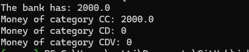

# jubilant-pancake-bank

## Description

This is a simple bank application that allows users to create accounts, deposit and withdraw funds, and view their account balance.
It also has the ability to generate a key pair for each account and sign transactions with the private key.
It can also verify the user with a 2FA code, sent via email.
The application is written in Python.

## Requirements

python >= 3.9

To run the project, you need to have Python installed on your machine. You can download Python from the [official website](https://www.python.org/downloads/)

**Setting Up the Environment**

* Windows: `./setup_Windows.bat`
* Linux/macOS: `./setup_Linux.sh`

These scripts will install required dependencies, and build a virtual environment for you if you don't have one.

## Usage

The file `main.py` contains an example of how to use the bank application.

```bash
cd bin
python ./main.py
```



## License

This project is licensed under the MIT License - see the [LICENSE](LICENSE) file for details.

## Author

[Neetre](https://github.com/Neetre)
